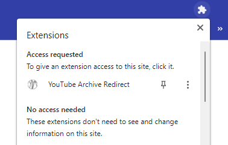

# YouTube Into The Archive

A simple Chrome extension that finds YouTube videos on Internet Archive for easy redirection. Pin it to the taskbar, and go onto a YouTube video. It will change color depending on whether that video is available on the Internet Archive. Bob's your uncle.

Uses the GNU GPLv3 License.
